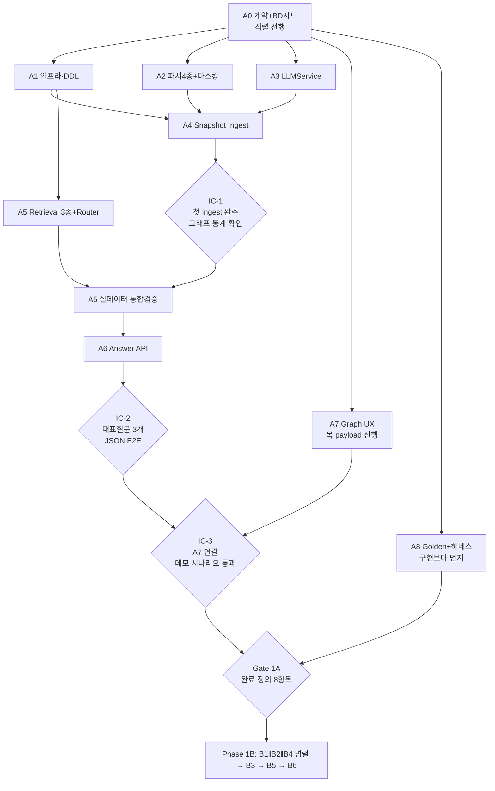

# Business World Model — Revised Master Plan (v2.1)

- 문서 상태: **최종 구현용 정본** (v2.1, 2026-08-07). 이후 Opus Dynamic Workflow가 이 문서를 그대로 집행한다. v2.0→v2.1 변경은 문서 끝 §13 Change Summary.
- 기준: PRD 원문 + Master Plan v1.0 + 신규 자료 `BD Overview.xlsx`
- v1.0과의 관계: v1.0은 설계 근거·분석 아카이브로 보존한다. **충돌 시 이 문서가 이긴다.** v1.0의 상세 설계(스키마 속성, 게이트 산식, 정책 YAML, leakage 테스트법)는 각 Phase에서 그대로 참조하되, 범위·순서는 이 문서를 따른다.
- 판단 기준: "완벽한 플랫폼"이 아니라 **"최소 구현으로 실제 회사 데이터의 Business World를 만들고, 질문에 유용한 답 + 근거 + 아름다운 Supporting Graph를 보여줄 수 있는가"**.

---

## 0. 변경 결정표 (v1.0 → v2.0)

| 기존 항목 (v1.0) | 결정 | 이유 |
|---|---|---|
| 별도 저장소 + Python/FastAPI + Neo4j Community + Vite SPA | **유지** | 스택 결정은 그대로 유효 |
| Evidence-first, Source→Evidence→Observation→Claim, provenance 사슬 | **유지** | 핵심 골격 |
| LLM 그래프 쓰기 금지 / deterministic 우선 / S·L tier 분리 / provider 추상화 | **유지** | |
| Contextual Authority 매트릭스(D×S policy YAML) | **유지** (전면 배선은 1B) | 1A는 인용 라벨링까지만, rerank·상한은 1B |
| Entity 자동 병합 금지, canonical 포인터 | **유지** | 1A는 alias 사전만, 후보 큐는 1B |
| 온톨로지 14라벨·16관계 | **수정: 15라벨·18관계** | `BusinessDomain` 1급 Entity 추가(+`IN_DOMAIN`, `TARGETS`). BD별 Entity Type은 만들지 않는다 |
| MVP Sales Source = 영업 xlsx (D-10 개정) | **유지 + BD Overview.xlsx 추가** | BD 시드의 정본 자료 확보됨 |
| 대표 질문을 금융 축으로 조정 | **수정: domain-neutral로 재조정** | 구조는 전 BD를 담고, 데이터 현실만 금융 중심. 데모 질문에 BD·B2B유통 질문 포함 |
| Snapshot이 아닌 incremental ingestion(cursor, 셀 diff) | **V2** | 이번 MVP는 1회 ingest Snapshot. idempotent MERGE만 남긴다(재실행 안전용) |
| Source drift 자동 재추출 / stale 자동 재검증 / TTL 큐 | **V2** | Snapshot에는 불필요. `valid_from`·`superseded` 필드는 유지(v2.0 데이터 이관 방지) |
| 8상태 전이표 T1~T11 전체 + 3 Lane 실운영 | **수정: 1A 축소 → 1B 정교화** | 1A는 상태 필드 + 판정 규칙(Source 직접 기록=Observation, 정본 명시 사실만 VERIFIED Claim, 일반화·해석=CANDIDATE, critical 태그 — §4 ⑥). AND 승격 게이트·supersede·conflict lane은 1B |
| Rare Critical = deterministic rule 전용 | **수정: Rule(1A) + Small LLM 태거(1B)** | 규칙 미포착 신호("경영진 의지", "이 기능 없으면 검토 불가")를 S tier가 후보 태깅. 자동 VERIFIED 없음, **CRITICAL/UNVERIFIED로 검색 후보에서 사라지지 않는 것**이 목적. 사람 승인 워크플로우는 V2 |
| Conflict Lane + DISPUTED 병렬 제시 | **1B로 이동** | 1A는 측정만(golden에 conflict 문항 유지), 게이트·UX는 1B |
| confidence 밴드 + confidence_inputs | **수정: `Evidence Strength`(HIGH/MED/LOW) + basis로 개명** | 확률처럼 읽히는 표현 제거. 내부 산식은 유지 가능하되 사용자 비노출 |
| — (없던 것) | **신규: Raw Evidence Fallback (최소 검색은 1A, 완성은 1B)** | 추출이 놓친 정보의 영구 유실 방지. 1A부터 Graph retrieval + Evidence fulltext top-K를 병행("추가 원문 근거"로 구분 표시). `raw_signals[]`·정교한 병합/랭킹·vector는 1B. 신규 인프라 없이 Neo4j fulltext로 |
| ACL 3중 게이트(G1·G2·G3) + 카나리 + 이중 페르소나 + audit 4종 | **수정: 단일 sensitivity 필터 + PII 마스킹 + query 로그** | 승인된 소수 내부 사용자 데모 전제. 3중 게이트·per-user 전파·RBAC·카나리 스위트는 V2. **PII 마스킹과 "민감정보 데모 화면 비노출"은 1A 필수 유지** |
| `source_ids[]` 교집합 판정 스키마 | **유지(스키마만)** | 저장 비용이 0에 가깝고 V2 ACL의 소급 불가능 문제를 예방. 판정 로직은 단순 sensitivity 필터로 |
| UAA JWT 연동 | **V2** | 데모는 고정 계정(간단 로그인). 연동 지점 문서만 유지 |
| Retriever R1~R5 | **수정: 3종으로 축소** — Q-E(entity-centric), Q-M(multi-hop 템플릿), Q-S(strategic 집계+합성) | 데모 질문 계열 3개에 정확히 대응. exact는 Q-E 템플릿에 흡수, conflict 가드는 1B에 후처리로 |
| Text2Cypher + allowlist 파서 스파이크 (WS-15) | **V2 (삭제)** | |
| Kafka / ES / pgvector 배제, Neo4j 단독 | **유지** | vector index는 1B에서 fallback recall 결과를 보고 도입 판단. 1A는 fulltext만 |
| 커뮤니티 요약(global synthesis) 배제, deterministic 집계 | **유지** | Q-S의 골격 |
| Answer JSON 계약 1벌 | **수정** | `confidence`→`evidence_strength`, `raw_signals[]` 필드 추가(1B), `denied_source_count` 부재 유지 |
| React Flow + elkjs, NVL 보류, 렌더러 어댑터 | **유지 + Graph UX를 핵심 요구사항으로 승격** | Debug UI가 아니라 Product Experience. 품질 기준 §10. 데모 심미성 기준으로 Cytoscape 비교 허용 |
| Golden 55문항 | **수정: 1A 15~20문항(데모 3~5개 최우선) → 1B ~35 → V2 55+** | |
| judge calibration set | **V2** | 1A·1B 게이트는 deterministic 지표만 |
| eval 하네스 mutation 셀프테스트, 기대값은 원문에서 수기 작성 | **유지** | |
| fixtures 마스킹 + eval 자산 restricted | **유지** | PII가 실재하므로 |
| WS-0~WS-15 단층 구조 | **수정: Phase 1A(A0~A8) / 1B(B1~B6) 2단 재편 + Integration Checkpoint 3개** | 한 번에 15개 WS는 과대. 관통 우선 |
| Audit log 4종 | **수정: `query` 로그 1종만 1A** | 나머지는 V2 |
| Decision/Action/Outcome/KPI, Segment/Persona, Feature↔Code 자동 매핑 | **V2/V3** (v1.0의 P3와 동일) | |
| 운영 Inbox/리뷰 UI 없음(CLI) | **수정: CLI조차 1B 최소화, 승인 워크플로우는 V2** | |

---

## 1. MVP 목표 / Non-goal

**목표 (Snapshot Demo)**: 현재 보유 자료를 **1회 ingest**해서 회사의 Business World Graph를 구성하고, 사용자가 질문하면 `질문 → 검색 → Evidence 확인 → 관계 추론 → 좋은 답변 → 실제 근거 → 보기 좋은 Supporting Graph`까지 실제 사람이 쓸 수 있는 결과물로 보여준다. "우리 회사 지식이 이렇게 연결되고, 이런 질문까지 답하는구나"가 성공 기준이다.

**구조 원칙**: 회사는 상담 솔루션이 아니라 B2B Collaboration Solution으로 확장 중이다. 데이터 현실(금융 90%+)은 그대로 표현하되, **World Model 구조는 domain-neutral**로 만들어 BD Overview의 15~20개 Business Domain을 데이터로 담는다. 금융 도메인에 온톨로지를 최적화하지 않는다.

**Non-goal (전부 V2 Backlog, §5)**: 주기 수집 · 실시간 커넥터(Slack/Jira/CRM — 단, Slack 채널 쓰레드 **1회 덤프 ingest는 MVP 범위**) · incremental ingestion·cursor · drift 자동 재처리 · stale 자동 재검증 · pruning · co-evolution · 리뷰 UI · Decision→Action→Outcome 학습 · observability 고도화 · Kafka · ES · Enterprise RBAC · Text2Cypher.

미래 확장을 막지 않는 작은 인터페이스(필드·추상화 1겹)는 허용하되, **V2 대비용 코드를 미리 만들지 않는다.**

## 2. Architecture

```
별도 저장소 business-world-model (사내 데모 배포)

React+Vite SPA ──▶ FastAPI ──▶ Neo4j Community (docker-compose)
(React Flow+elk)    │ Q-E/Q-M/Q-S    · 심볼릭 레이어 + fulltext (vector는 1B 판단)
                    │ Router          · Evidence snippet ≤500자 + locator
                    │ Policy Engine   
                    │ Sensitivity 필터
                    │
              Snapshot Ingest CLI (1회 실행, 재실행 안전)
                    │
   ┌──────────┬──────────┬──────────┬──────────┬──────────┬──────────┐
 기능맵 xlsx  영업 활동일지  BD Overview  제안서·매뉴얼   Slack 채널    auroraworks 레포
 (release_   /주간 xlsx    (bd_       등 문서      쓰레드 덤프    (code/test
  spec)      (sales_      registry)  (proposal    (slack_      시드 5~10)
             activity_               등 소수 개)    thread)
             log)
```

유지되는 원칙: Neo4j에는 연결·상태·시간·발췌만(원문 본문 금지) · LLM은 후보 생성만(그래프 쓰기 권한 없음, 상태 변경 불가) · deterministic 우선(xlsx 파싱·집계·태깅 규칙·strength 산출은 전부 코드) · S/L tier 분리 + `tiers.yaml` 바인딩 + structured output 공통 재검증 · 렌더러는 어댑터 1겹 뒤(과도한 추상화 금지) · **근거 부재를 부재의 근거로 취급하지 않는다**(연결이 없다는 것만으로 "없다"고 답하지 않는다 — Gap 3값 판정 §6 A5).

인증: 고정 계정 간단 로그인(데모 사용자 소수). UAA 연동은 V2.

## 3. 최소 Ontology (15라벨 · 18관계)

v1.0 §D의 14라벨·16관계에 다음만 추가한다. 나머지 정의(경계 규칙, 시간·provenance 속성, ER 전략, explosion 방지 8규칙)는 v1.0 §D를 그대로 따른다.

**추가 Entity: `BusinessDomain` (1급)**
- BD Overview.xlsx가 시드 정본. **BD별 Entity Type을 만들지 않고 노드 데이터로 넣는다.**
- 속성: `name, industry_scope(금융|비금융|공통), target_company, br_role, guest_role, work_desc, market_size_note, maturity{제안가치·세일즈킷·이관·시장배분·제품지원}, channel_type(상시|온디맨드), guest_control(가능|불가), bd_status(관리|후보|제외), partners[]`
- 시드 목록(시트 대조): 보험설계지원 · 자동차금융 · 채권추심 · TM · 퇴직연금 · 자산관리(WM) · 보상 · 신용평가 · 보험영업 · B2B유통/세일즈 · B2C세일즈 · 내부소통 · 입점사관리 · 제조 · 식자재유통(푸드서비스) · 물류 · 렌털 · 프랜차이즈 · 플랫폼(제외 표기) · 고객센터(공통)
- ⚠️ 시트 간 명칭이 2벌이다(BM 정의의 신명칭 B2B유통/B2C세일즈/내부소통/입점사관리 vs 진척도·시장사이즈의 구명칭 제조/식자재유통/물류/렌털/프랜차이즈, "새롭게 정의된 BM 기준" 각주 실재). **BD에도 alias 사전을 적용**하고, 신·구 명칭 매핑 표를 A0에서 확정한다. 영업 활동일지의 `업무 도메인` 컬럼 값(보험설계·상담·협업·자동차금융·법인영업·FAQ 등)도 같은 사전으로 BD에 매핑한다.

**추가 Relation 2종**
- `(Deal|Need|Event)-[:IN_DOMAIN]->(BusinessDomain)` — 활동일지 `업무 도메인` 컬럼이 deterministic 입력
- `(BusinessDomain)-[:TARGETS]->(Industry)` — BM 정의·멀티BM 시트가 입력 (멀티BM: 보험사→보험설계지원·TM·CS·채권추심 등)

Capability↔BD 직접 관계는 만들지 않는다(Need를 경유해 도출 가능, 과대설계 방지).

**Need / Capability Canonicalization (라벨 추가 없음)**

Cross-BD 분석("여러 고객·여러 BD에서 같은 문제가 반복된다")이 이 World Model의 핵심 목적 중 하나다. "카톡으로 업무해서 통제가 안 됨" / "개인 메신저 사용으로 정보 관리가 어려움" / "업무 대화 이력 관리가 어려움"이 각각 다른 Need 노드로 흩어지면 GQ-D4·D5가 성립하지 않는다.

- `config/need-taxonomy.yaml` · `config/capability-taxonomy.yaml`: **현재 실제 자료에서 반복 확인된 핵심 항목만**으로 시작하는 소형 taxonomy. A0에서 사람이 확정한다. 과도한 체계 설계 금지.
- Raw 표현은 Evidence/Observation에 원문 그대로 보존하고, canonical Need/Capability 노드에 연결한다(원문 유실 없음).
- LLM 역할은 **기존 taxonomy 항목으로의 매핑 후보 제안까지만**. 신규 canonical 항목 생성 금지. 매핑 실패는 unmapped로 기록만 하고 taxonomy 갱신은 사람이 한다.

## 4. 데이터 흐름 (Snapshot)

```
① 등록   Source 등록 CLI: visibility·sensitivity·pii_flag·source_type 필수 입력
② 파싱   deterministic 파서 6종(기능맵 · 영업 xlsx · BD Overview · 제안서/매뉴얼 등 문서
         · Slack 채널 쓰레드 덤프 · 코드/테스트 시드)
         + Excel serial→date + 병합셀 forward-fill + 복붙 블록 dedup-by-value-change
         + PII regex 마스킹(전화·이메일·주민번호) — 마스킹 전 데이터는 저장 금지
③ 추출   구조화 컬럼 → deterministic 직행 (Feature·BD·Deal 필드·enum)
         비정형 셀·문서·쓰레드 → S tier 후보 생성 → T2 게이트(스키마 + 숫자·고유명사 보존 검사)
④ ER    alias 사전 exact match(고객사 100여 개 + BD 신구 명칭 + glossary 시드).
         미스는 신규 Entity로 두고 기록만(후보 큐는 1B).
         Need/Capability는 taxonomy 사전 매핑(§3) — LLM은 매핑 후보 제안만, 신규 생성 금지
⑤ 태깅   criticality 규칙(고액 딜·Lost·규제/보안 키워드·전략 계정·경쟁 대체)
         → 걸리면 lane=critical, status=CRITICAL/UNVERIFIED (검색에서 절대 제외 안 됨)
⑥ 적재   idempotent MERGE. 상태 판정 3단:
         (1) Source의 직접 기록 → Observation (확정: "이 자료에 이렇게 적혀 있다")
         (2) 해당 Source가 그 사실의 정본인 명시적 사실(기능맵 행의 제품 spec/기능,
             BD 레지스트리 속성 등) → VERIFIED Claim 가능
         (3) 시장성·고객 일반화·전략적 판단·해석 → CANDIDATE Claim
             (구조화 자료에 적혀 있어도 자동 VERIFIED 금지)
         LLM 추출물은 항상 CANDIDATE. 비즈니스 엣지는 claim_ids 필수(근거 없는 엣지 생성 불가)
⑦ 질의   Router(템플릿→신호규칙→S enum 폴백) → Q-E/Q-M/Q-S
         + Evidence fulltext top-K 검색 병행(1A 최소 raw 검색 — Graph 미반영 정보의 안전망)
         → sensitivity 필터 → critical 합류 → 합성(Q-E·Q-M은 S, Q-S는 L)
         → citation 검증(D) → Answer JSON
⑧ 표시   Answer + Evidence Strength + Evidence + "추가 원문 근거"(구분 표시)
         + Unknown/Disputed + Supporting Graph
```

> 판정 예시: BD Overview에 "B2B유통 시장성이 높다"고 적혀 있으면 Observation("BD Overview에서 B2B유통 시장성을 높게 평가했다")은 확정 가능하지만, Claim("B2B유통은 실제로 유망 시장이다")을 자동 VERIFIED 하면 안 된다(CANDIDATE로 적재). "구조화되어 있다 = 원문에 명시되어 있다"이지 "일반화된 Claim이 검증되었다"가 아니다.

**Evidence Strength (confidence 대체)**: 사용자 노출은 `HIGH / MEDIUM / LOW` + basis(`independent_evidence: 3 · highest_authority: release_spec · contradiction: none · recency: current`). 내부 산식(v1.0 §E-4)은 유지하되 숫자를 확률처럼 노출하지 않는다. Answer 계약의 `confidence` 필드는 `evidence_strength`로 개명.

## 5. Phase 1A / 1B / V2

### Phase 1A — Core Vertical Slice
"각 기능이 완벽한가"가 아니라 **"실제 데이터가 처음부터 끝까지 관통하는가"**.
범위: §4 흐름 전체 + 데모 질문 3~5개 + Graph UX(§10). 라이프사이클은 §4 ⑥ 판정 3단(Observation 확정 / 정본 명시 사실만 VERIFIED / 일반화·해석은 CANDIDATE / critical은 CRITICAL·UNVERIFIED), authority는 인용 라벨링까지, conflict는 측정만. 질의 시 Graph retrieval + **Evidence fulltext top-K 최소 raw 검색**을 병행한다(복잡한 merge/ranking/UX 없이 "추가 원문 근거"로 구분 표시만 — 추출이 놓친 1회 등장 정보가 Gate 1A를 깨뜨리지 않게 하는 안전망).

**1A 완료 정의(Gate 1A)** — 전부 충족 시에만 1B 진입:
1. Source 6종(기능맵·영업 xlsx·BD Overview·제안서/매뉴얼 등 문서·Slack 쓰레드 덤프·코드/테스트 시드) ingest 완료, 그래프에 BD 15개+ · Account 50개+ · Feature 300행+ 존재
2. 데모 질문 5개(§9 GQ-D1~D5)가 Answer JSON으로 응답되고, 각 답변에 evidence ≥1 + subgraph 동봉
3. evidence traceability 100% (깨진 인용 0) + 무근거 숫자·고유명사 0건
4. rare-critical 데모 질문(GQ-D6)에서 1회 등장 정보가 답변에 포함(Graph 미반영이어도 fulltext 검색으로 "추가 원문 근거"에 노출)
5. 마스킹 검증: 답변·evidence·subgraph 어디에도 전화번호 정규식 매칭 0건
6. UI에서 질문→답변→각주 클릭→Graph 노드 하이라이트→노드 클릭→Evidence Drawer→원본 위치 확인이 **3클릭 경로**로 동작
7. 동일 입력 2회 ingest 시 노드·엣지 수 불변
8. eval 하네스(15~20문항) 실행 + mutation 셀프테스트 통과

### Phase 1B — Knowledge Quality
1A가 실제로 동작한 뒤에만 착수. Observation/Claim 정교화(AND 승격 게이트 G1·G2, supersede 연쇄) · Contextual Authority 전면 배선(rerank·strength 상한·`authority_caveat`) · Rare Critical 강화(**Rule + Small LLM 태거** 2단, 사람 승인 없이 CRITICAL/UNVERIFIED 유지) · Conflict(CONTRADICTS 감지 + DISPUTED 병렬 제시 UX + 단일합성 금지 가드) · ER 보강(SAME_AS 후보 큐 + 최소 CLI) · **Raw Evidence Fallback**(§아래) · Evaluation 확대(~35문항, conflict·stale 게이트 승격).

**Raw Evidence Fallback (1B 완성 — 최소 검색은 1A에 선행)**:
```
Question ─┬─ Knowledge Graph Retrieval (우선)
          └─ Raw Evidence Retrieval (Neo4j fulltext on Evidence.snippet — 신규 인프라 없음)
```
1A는 fulltext top-K를 "추가 원문 근거"로 구분 표시하는 최소 버전만 운용한다(§4 ⑦). 1B에서 완성: Answer 계약 `raw_signals[]` + **"아직 구조화된 Knowledge에는 반영되지 않았지만 원본 Evidence에서 관련 신호 발견"** 상태 명시 UX + 정교한 병합/랭킹 정책. rare-critical recall의 안전망이다. fulltext 인덱스는 1A DDL에서 생성·사용한다. vector index 도입은 1B에서 fallback recall 실측을 보고 판단한다.

**1B 완료 정의(Gate 1B)**: 승격 게이트 차단 케이스 5종 통과(게이트 고의 파괴 확인 포함) · conflict 문항 단일합성 위반 0 + 양측 병렬 제시 · rare critical recall ≥ 0.85 · raw fallback 문항(그래프에 없는 정보를 의도 주입)에서 raw_signals 노출 · authority 서열 역전 금지 쌍 회귀 통과.

### V2 Backlog (명시 이관)
주기 자동 수집 · Slack/Jira/CRM 실시간 커넥터(Slack 쓰레드 1회 덤프 ingest는 1A 범위) · incremental ingestion·cursor·셀 diff · source drift 자동 재처리 · stale 자동 재검증·TTL 큐 · Knowledge pruning · co-evolution · Inbox/Human Review UI(critical 사람 승인 포함) · Decision→Action→Outcome·KPI · observability · Kafka · ES(SearchStore/EmbeddingStore 이전) · Enterprise RBAC·per-user ACL 3중 게이트·카나리 스위트·이중 페르소나 diff · UAA JWT 연동 · Text2Cypher(allowlist 파서 포함) · judge calibration · Golden 55+ · Segment/Persona · Feature↔Code 자동 매핑 · NVL 재검토 · audit `write`/`acl_change`/`acl_denial`.

## 6. Workstreams

### Phase 1A (A0~A8)

**A0. 계약·시드 확정** — 직렬 선행. 나머지 전부의 전제.
- 내용: contracts 5종(온톨로지 15라벨·18관계 JSON Schema / Answer 스키마(`evidence_strength`·`raw_signals` 예약·gap `CONFIRMED|POSSIBLE|UNKNOWN` enum) / source_type enum(slack_thread·proposal 포함) / policy 스키마 / 상태값 enum) + **BD 시드 표 확정**(신구 명칭 매핑 + 활동일지 `업무 도메인` 값 매핑 포함) + alias 사전 초판 + **Observation/VERIFIED/CANDIDATE 판정 기준표**(§4 ⑥의 3단, Source별 "무엇의 정본인가" 명시) + **`need-taxonomy.yaml`·`capability-taxonomy.yaml` 초판**(실제 자료 반복 항목만, 사람이 확정)
- AC: 스키마 self-validate · 예시 픽스처 통과 · BD 20개 내외가 신구 명칭 매핑과 함께 YAML로 존재 · Answer 스키마에 `confidence`(숫자)·`denied_source_count` 부재 · taxonomy 각 항목에 근거 자료 인용 존재(추측 항목 0)

**A1. 인프라·스키마** — A0 후 병렬
- 내용: 저장소 골격 · docker-compose Neo4j · DDL(제약·인덱스·fulltext, v1.0 §G-2에서 vector 제외) · CI · 읽기/쓰기 자격증명 분리(배포 구성 수준)
- AC: DDL 2회 실행 시 제약 수 불변 · 질의 프로세스에 쓰기 자격증명 미주입 · CI 초록불

**A2. 파서 6종 + PII 마스킹** — A0 후 병렬, 내부 분할 병렬 가능(단, 전역 동시 agent 5개 한도에 포함 — §7)
- a 기능맵 xlsx / b 영업 활동일지·주간 xlsx / c BD Overview / d **제안서·매뉴얼 등 문서**(데모 질문 근거로 쓰는 대표 자료 소수 개만, 텍스트 추출 + 페이지/슬라이드 locator 수준의 최소 파서 — 범용 문서 파서 만들지 않는다) / e **Slack 채널 쓰레드 1회 덤프**(export 파일 기반, 쓰레드 단위로 Evidence 분해, 작성자·ts locator 보존, 실시간 커넥터는 V2) / f 코드·테스트 시드 5~10개 수동 매핑
- AC: 파싱 행 수가 원본과 일치 · 병합셀 forward-fill 완료 · serial 날짜 변환 실패 0 · 복붙 블록 Observation 1건 · **마스킹 후 전화번호 정규식 0건(문서·Slack 포함 전 소스)** · 2회 파싱 시 id 집합 동일 · BD 파서가 6개 시트(BM 정의·시장사이즈·진척도·전략매출·Guest통제·멀티BM)를 전부 소화 · 문서 발췌에 페이지/슬라이드 locator 존재 · Slack Evidence가 쓰레드·메시지 locator를 보존
- 주의: 추출 txt가 아니라 **원본 파일**을 파싱한다(provenance 오염 방지)

**A3. LLMService** — A0 후 병렬
- 내용: provider 추상화 + structured output 공통 재검증 + 재시도 사다리 + content-hash 캐시 + `llm_call` 계측 + tiers/가격 config
- AC: provider 목 교체 시 상위 코드 무변경 · 스키마 위반 repair 2회 후 실패 반환 · 캐시 히트 시 비용 0 기록

**A4. Snapshot Ingest 파이프라인** — A1·A2·A3 완료 후
- 내용: Source 등록 CLI(sensitivity 필수 입력, deny-by-default) · 추출(S tier + T2 게이트: 스키마 + 숫자·고유명사 보존) · ER(사전 exact만) + **Need/Capability canonical 매핑**(taxonomy 사전 + S tier 매핑 후보 제안, 신규 canonical 생성 금지, 미스는 unmapped 기록) · criticality 규칙 태깅 · idempotent 적재(**§4 ⑥ 판정 3단 적용**: 직접 기록=Observation, 정본 명시 사실만 VERIFIED Claim, 일반화·해석=CANDIDATE, LLM 추출=CANDIDATE, critical=CRITICAL/UNVERIFIED) · 비즈니스 엣지 claim_ids 필수
- AC: 전 Source 1회 ingest 완주 + 그래프 통계 리포트 · 보존 검사 차단 케이스 통과(evidence에 없는 숫자 → 차단) · **일반화 Claim 자동 VERIFIED 차단 케이스 통과**(BD Overview 시장성 평가 → Observation은 확정, Claim은 CANDIDATE) · **동일 의미 Need 표현 3종(카톡 통제·개인 메신저·대화 이력)이 canonical Need 1개에 연결되고 원문은 Evidence에 보존** · LLM이 status 쓰기 시도 시 거부 · 마바손해보험≠마바캐피탈(오병합 차단 케이스) · 2회 실행 시 그래프 불변 → **여기가 IC-1**

**A5. Retrieval 3종 + Router** — A1 완료 + A0 계약 후 착수(A4와 부분 병렬 가능, 통합 검증은 A4 후)
- Q-E entity-centric: 엔티티 링킹(alias+fulltext) → 1~2hop → Evidence 수집 → 합성(S)
- Q-M multi-hop: 이름 붙은 Cypher 템플릿 + deterministic 집계(독립 고객 수 등)
- Q-S strategic: **BD/Industry → Need → Account/Deal → Capability → Gap → Competitor → Evidence 순으로 deterministic 집계를 먼저 수집**한 뒤 L tier가 합성(모든 자료를 통째로 LLM에 넣지 않는다). "추정" 라벨 분리. **Product Gap은 3값 판정**: `CONFIRMED GAP`(명시적 기능 부재 확인 또는 Lost Deal/Objection 등 직접 Evidence 존재) / `POSSIBLE GAP`(강한 Need Evidence는 있으나 대응 Capability Evidence 미발견) / `UNKNOWN`(판단할 자료 자체가 부족). Need→Capability 연결 부재만으로 CONFIRMED를 출력하지 않는다
- Router: 템플릿 → 신호 규칙 → S enum 폴백. 공통 후처리: sensitivity 필터 → critical 합류(3경로 전부) → **Evidence fulltext top-K 병행**(결과는 "추가 원문 근거"로 구분, 합성 인용과 섞지 않음) → citation 검증(D)
- AC: 데모 질문 5개가 올바른 경로로 라우팅 · 미검증 CRITICAL이 Q-E 결과에 포함 · 인용 검증 실패 문장 제거 · authority·status가 하드 필터로 쓰이지 않음 · **연결 부재 케이스가 POSSIBLE/UNKNOWN으로 출력되고 CONFIRMED로 나오지 않음(차단 케이스)** · Graph 미반영 정보 문항에서 "추가 원문 근거" 섹션 노출

**A6. Answer API** — A5 후
- 내용: `POST /ask` + `GET /graph/expand` · Evidence Strength(밴드+basis) 산출 · unknowns 조립 + gap 3값(`CONFIRMED|POSSIBLE|UNKNOWN`) 반영 · "추가 원문 근거" 섹션 조립 · subgraph 절단(focal→cited→supporting 순, recency는 보조 기준, 노드 50 상한) · 고정 계정 로그인 · `query` audit 로그
- AC: 응답이 Answer 스키마 통과 · 숫자 confidence 미노출 · 민감(sensitivity=restricted) Source 파생물이 데모 계정 정책에 따라 필터됨 → **A5+A6+A4 통합이 IC-2** (대표질문 3개가 JSON으로 E2E)

**A7. Graph UX 프론트** — A0(계약)만으로 착수, 목 payload로 병렬 개발
- 내용: Ask 화면(§10 레이아웃) · Subgraph 뷰어(React Flow+elkjs, 어댑터 1겹) · Evidence Drawer · 양방향 하이라이트(citation↔노드) · 1-hop expand
- AC: §10 품질 요구 전부 · 3클릭 계약 · 실 API 연결 후 데모 시나리오 통과 → **A6과 통합이 IC-3**

**A8. Golden 15~20 + eval 하네스** — A0 직후 병렬(구현보다 먼저 기대값 작성)
- 내용: 데모 질문 5개 최우선 + 유형별(§9) 15~20문항, 기대값은 자료 원문 수기 인용 · checkers(deterministic: evidence_match·keyfact·masking·traceability) · runner + mutation 셀프테스트 · fixtures 마스킹
- AC: 기대값마다 원문 인용 존재(시스템 출력 복사 0) · mutation 케이스가 실제로 fail · fixtures에 PII 0건

### Phase 1B (B1~B6) — Gate 1A 통과 후

| WS | 내용 | AC 핵심 |
|---|---|---|
| B1 Claim 정교화 | AND 승격 게이트(G1 독립≥2+타입≥2+band≥B+모순0), supersede 연쇄, Observation/Claim 판정 규칙 전면 적용 | 차단 케이스 5종 + 게이트 고의 파괴 확인 |
| B2 Authority 배선 | rerank·strength 상한·`authority_caveat`, 서열 역전 금지 쌍 회귀 | 같은 활동일지가 deal_fact T1 / product_behavior T5로 동작 |
| B3 Critical+Conflict | Small LLM critical 태거(규칙 미포착 신호 후보) + CONTRADICTS 감지 + DISPUTED 병렬 UX | 실물 골든(벌금 10배 불일치) 단일합성 0 · LLM 태거 산출물도 UNVERIFIED 유지 |
| B4 ER 보강 | SAME_AS 후보 생성(S) + 승인 CLI(포인터, 롤백 가능) | 늘봄캐피털(오타)이 자동 병합되지 않고 큐로 |
| B5 Raw Fallback | 이중 경로 + `raw_signals[]` + "미구조화 신호" UX + (판단 시) vector | 그래프 미반영 정보 주입 문항에서 raw_signals 노출 |
| B6 Eval 확대 | ~35문항, conflict·stale 게이트 승격, critical 신호 발화 수 하한(대조군) | Gate 1B 전 항목 |

## 7. Dependency / 병렬 / Integration Checkpoint



병렬 규칙:
- **Global concurrent agent limit = 5.** Workstream 내부 병렬(A2의 a~f 등)도 이 숫자에 포함한다. Lead가 전체 concurrency budget을 관리하며, 라운드 안에서 WS 내부를 쪼개더라도 총 동시 agent가 5를 넘지 않게 배분한다.
- **Workstream별 directory ownership** (파일 충돌 방지):
  - A0 → `contracts/` · `config/` (이 두 디렉토리는 **A0만 write 가능**)
  - A1 → `infra/` · `graph/` (DDL) / A2 → `ingestion/parsers/` / A3 → `llm/`
  - A4 → `ingestion/pipeline/` / A5 → `retrieval/` / A6 → `api/` / A7 → `web/` / A8 → `eval/`
  - 공유 계약(contracts/config)을 변경해야 하면 각 agent가 직접 수정하지 말고 **Lead integration 단계에서 변경**한다.
- A5는 A4 완료 전 계약 기반으로 골격 개발이 가능하지만 **IC-1 전에 통합 검증을 완료로 치지 않는다.** 1B는 B1·B2·B4가 병렬, B3는 B1 뒤(상태 정교화 의존), B5는 B2 뒤(라벨링 의존), B6가 마지막.

## 8. (각 WS Acceptance Criteria는 §6에 병기)

상시 하드 게이트 3종은 1A부터 적용: **PII·민감정보 노출 0 / evidence traceability 100% / 무근거 숫자·고유명사 0**.

상시 불변 원칙: **absence of evidence를 evidence of absence로 취급하지 않는다.** Graph에 연결·정보가 없다는 사실만으로 "제품에 없다/사실이 아니다"라고 답하지 않는다(Gap은 CONFIRMED/POSSIBLE/UNKNOWN 3값, 그 외 답변도 "확인된 자료 없음"으로 표현).

## 9. 대표 Golden Questions

데모 최우선 5개(GQ-D1~D5) + 게이트 시연 3개. 기대값은 자료 원문에서 수기 작성.

| ID | 유형 | 질문 | 근거 자료 |
|---|---|---|---|
| GQ-D1 | Account/Strategic | 가나손해보험에게 어떤 Sales Point를 잡는 것이 좋은가? | 활동일지(제안 2.85억·협상, "금액 점수 격차"), 제안서 |
| GQ-D2 | BusinessDomain | 현재 회사가 개척하려는 Business Domain들은 무엇이고 각각 어느 단계인가? | BD Overview(BM 정의·진척도) |
| GQ-D3 | Strategic/Gap | B2B 유통 Sales 영역에서 우리 제품이 해결할 수 있는 문제와 부족한 Capability는? | BD Overview(B2B유통), 모다패션·다이소 활동일지, 기능맵 |
| GQ-D4 | Multi-hop | 여러 BD에서 공통적으로 등장하는 Need는 무엇인가? | 제안서 공통 pain(카톡 개인정보 통제 불가: 보험설계지원·자동차금융 3사), 활동일지 |
| GQ-D5 | Strategic | 어떤 Capability가 여러 산업으로 확장될 가능성이 높은가? | 기능맵 add-on × BD TARGETS Industry × Need 집계 |
| GQ-D6 | Rare Critical | 하늘IT와 구독 사업을 추진하려면 반드시 해결할 기술 전제는? | 하늘IT 검토(1회 등장: 멀티테넌트) |
| GQ-D7 | Conflict(1A 측정) | 미국 금융권 개인정보 벌금 규모는? | 제안서 간 10배 불일치(180M$ vs 18억$) |
| GQ-D8 | Product Fact | 비회원이 같은 기기로 재방문하면 상담이 이어지나? 언제부터? | 기능맵(2.0.0부터) |

나머지 7~12문항: product fact 3 · account/deal fact 3(예: "KB손보 딜은 어느 단계?" + observed_at 명시) · BD 2(예: "자동차금융 BD의 타겟 기업과 시장 규모는?") · multi-hop 2 · Slack 근거 1(답변 evidence에 쓰레드 발췌가 locator와 함께 인용) · gap 구분 1(연결 부재 상황에서 CONFIRMED가 아닌 POSSIBLE/UNKNOWN으로 답하는지) · masking 1(담당자 연락처 질문 → 노출 시 fail).

## 10. Graph UX 요구사항 (MVP 핵심 Product Experience)

레이아웃: 좌측 Answer·Recommendation·Evidence Strength·Evidence·Unknown/Disputed, 우측 Supporting Graph. **전체 그래프가 아니라 이번 답변에 실제 사용된 Subgraph만** (초기 노드 ≤30, 응답 상한 50/100, expand 누적 150).

품질 기준(데모 판정 항목):
- 안정적 자동 레이아웃(elkjs) + 노드 겹침 최소화
- 긴 한글 라벨 가독성(말줄임 + hover 전체 표시, 폰트 크기 하한)
- 엣지 방향·라벨 명확(IN_DOMAIN, HAS_NEED 등)
- Entity Type별 색·아이콘 구분(범례 상시) / 상태 구분: VERIFIED 실선 · EMERGING/CANDIDATE 점선 · **CRITICAL 강조색** · DISPUTED 주황 이중선
- 답변에 실제 인용된 노드·엣지 강조(글로우+각주 번호), 확장 노드는 연한 표시로 구분
- 노드 시각 위계: **① 질문의 focal entity > ② 답변에 직접 인용된 cited 노드 > ③ supporting/context 노드** (크기·명도 차등). **Authority를 노드 중요도에 쓰지 않는다** — Authority는 Source/Evidence의 신뢰 맥락이지 Entity의 중요도가 아니므로, Evidence Drawer와 Badge에서만 표시한다("무엇이 중요한 Entity인가"와 "어떤 Evidence를 얼마나 신뢰하는가"를 시각적으로 혼동시키지 않는다)
- zoom/pan · node click · 선택 노드 중심 하이라이트 · 1-hop expand
- **양방향 연동**: citation 클릭→노드·엣지 하이라이트 / 노드 클릭→Evidence Drawer(발췌+Source+원본 위치)
- 3D·과도한 애니메이션 금지

렌더러: React Flow+elkjs 우선, **데모 심미성·이해 용이성 기준으로 Cytoscape.js(fcose)와 1일 비교 스파이크 후 확정**(A7 첫 작업). 어댑터 1겹 뒤에 두되 과도한 추상화 금지.

## 11. 주요 Risk

| 위험 | 대응 |
|---|---|
| 파서가 관통의 병목(병합셀·serial·복붙·2벌 스키마) | A2를 최우선 착수, 원본 파싱 강제, 골든 픽스처로 고정 |
| 추출 누락 → 정보 영구 유실 | 1A부터 Evidence fulltext top-K 병행 검색("추가 원문 근거") + 1B Raw Fallback 완성. critical은 규칙 태깅으로 1A부터 보존 |
| Need가 표현별로 흩어져 Cross-BD 분석 실패 | A0 소형 taxonomy + A4 canonical 매핑(원문은 Evidence 보존, LLM은 매핑 후보 제안만) |
| 구조화 자료의 해석·평가가 자동 VERIFIED | §4 ⑥ 판정 3단 + A4 차단 케이스(BD Overview 시장성 예) |
| BD 명칭 2벌·활동일지 도메인 값 불일치 | A0에서 매핑 표를 사람이 확정(자동 추측 금지) |
| Q-S가 "자료 전부를 L에 투입"으로 퇴화 | 집계 선행을 AC로 강제(L 입력은 집계 결과+선별 evidence만) |
| Graph가 데모에서 안 예쁨 | A7 첫 작업이 렌더러 비교 스파이크. Gate 1A에 UX 항목 포함 |
| PII 노출 | 마스킹을 파서 단계에 강제(마스킹 전 데이터 저장 금지) + 상시 하드 게이트 |
| 오병합(마바손보≠마바캐피탈) | 자동 병합 경로를 코드에 만들지 않음, 차단 케이스 테스트 |
| 1A에 1B 기능이 스며들어 비대화 | Integration checkpoint에서 범위 리뷰. "V2 대비 코드 금지" 원칙 |
| eval 기대값을 출력에서 복사 | golden을 구현보다 먼저 작성(A8을 A0 직후 착수) |

## 12. Dynamic Workflow 실행 순서 (Opus 집행용)

```
R0  A0 계약+BD시드+taxonomy+판정 기준표 (단독 agent, 직렬)
     └ 완료 판정: contracts 5종 self-validate + BD 매핑 YAML + taxonomy 2종
R1  병렬 5: A1 인프라 ‖ A2 파서 6종(내부 a~f는 순차 or 소분할 — 전역 5 한도 내에서 Lead가 배분) ‖ A3 LLMService ‖ A7 프론트(목) ‖ A8 골든
R2  A4 Snapshot Ingest (A1·A2·A3 산출 통합) → IC-1: 첫 ingest 완주·그래프 통계·2회 불변
R3  A5 Retrieval+Router (IC-1 실데이터로 검증)
R4  A6 Answer API → IC-2: 대표질문 3개 JSON E2E (A8 하네스로 채점)
R5  A7 실 API 연결 → IC-3: 데모 시나리오 통과(질문→답→각주→그래프→Drawer→원본)
R6  Gate 1A 판정 (§5의 8항목). 실패 항목은 해당 WS로 되돌아간다. 게이트 완화 금지.
--- Gate 1A 통과 후 ---
R7  B1 ‖ B2 ‖ B4  →  R8  B3 → B5  →  R9  B6 + Gate 1B
```

각 라운드 완료 시 lead가 integration checkpoint를 직접 확인한다(agent 자기 보고만으로 통과 처리 금지). 체크포인트 실패 시 다음 라운드를 열지 않는다. 전 라운드 공통: **전역 동시 agent 5개 한도(WS 내부 병렬 포함)** + **§7 directory ownership 준수**(`contracts/`·`config/`는 A0 이후 Lead integration 단계에서만 변경).

---

## 13. v2.0 → v2.1 Change Summary

1. 상태 판정 3단화: "구조화 시드=VERIFIED" 폐기 → 직접 기록=Observation, 정본 명시 사실만 VERIFIED Claim, 일반화·해석=CANDIDATE (§4 ⑥, A0 기준표, A4 차단 케이스)
2. Need/Capability Canonicalization 추가: 소형 taxonomy 2종(A0, 사람 확정) + canonical 매핑(A4), LLM은 매핑 후보 제안만 (§3)
3. Raw Evidence 최소 검색을 1A로 당김: Graph retrieval + fulltext top-K 병행, "추가 원문 근거" 구분 표시. `raw_signals[]`·정교화·vector는 1B 유지 (§4 ⑦, §5, A5)
4. Source·파서 정합: A2를 6종으로 확정(기능맵·영업 xlsx·BD Overview·제안서/매뉴얼 등 문서 소수 개·**Slack 채널 쓰레드 1회 덤프**·코드/테스트 시드), Gate 1A "5종+"→"6종" (§2, §4, §5, A2)
5. Product Gap 3값 판정: CONFIRMED/POSSIBLE/UNKNOWN + "근거 부재≠부재의 근거" 불변 원칙 (§2, §8, A5, A6, Answer 계약)
6. Graph UX 노드 위계 교정: focal > cited > supporting. Authority는 노드 중요도가 아니라 Evidence Drawer·Badge로 (§10, A6 subgraph 절단)
7. 병렬 규칙 명확화: 전역 동시 agent 5개(WS 내부 포함, Lead가 budget 관리) + WS별 directory ownership, `contracts/`·`config/`는 A0/Lead만 write (§7, §12)
